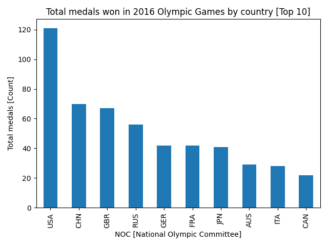

## Description
Crude python script utilizing pandas to fetch some interesting data from 
[Kaggle](https://www.kaggle.com/mysarahmadbhat/120-years-of-olympic-history)

Description and commentary provided elsewhere, some partial data can be found in results.txt

## Some rather mediocre plots attempting to visualize the data

